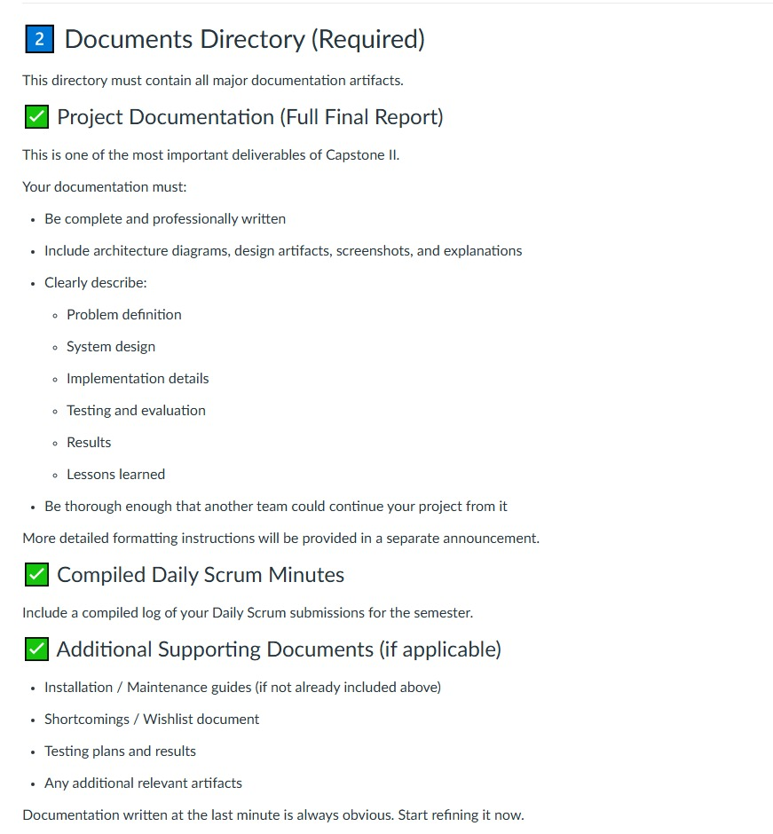

# IoT Shield — Capstone site documentation

This package documents the **IoT Shield** static marketing and project showcase site in `index.html`, its styles, scripts, and supporting materials. It is organized to align with the **Capstone II Documents Directory** expectations shown in the course guidelines below.

---

## Documents directory requirements (course guidelines)

The following image is the official checklist for what belongs in the project documentation directory (full final report quality and content, compiled Daily Scrum minutes, and additional supporting documents). **Use it as the master rubric** when you add or refine artifacts.

**Summary of the guidelines (from the rubric above):**

1. **Project documentation (full final report)** — Complete, professional writing; architecture diagrams, design artifacts, screenshots, and explanations; clear coverage of problem definition, system design, implementation, testing and evaluation, results, and lessons learned; thorough enough that another team could continue the work from this documentation alone. *(Formatting details may be announced separately.)*
2. **Compiled Daily Scrum minutes** — A single compiled log of Daily Scrum submissions for the semester.
3. **Additional supporting documents (if applicable)** — Installation or maintenance guides (if not in the main report), shortcomings / wishlist, testing plans and results, and any other relevant artifacts.

---

## How this repository maps to the full final report

| Report element | Where it is covered in this project |
|----------------|-------------------------------------|
| **Problem definition** | `index.html`: section `#section-problem` (“The Problem”) and opening copy under `#section-platform` / `#cta-384`. |
| **System design** | `index.html`: `#section-solution`, architecture figures in `assets/images/` (e.g. `Explanation.png`, `logflow.jpeg`, `siemLab.jpeg`, `teamroles.jpeg`, `workflow.jpeg`) and the **How it works** walkthrough carousel `#section-how-it-works`. |
| **Implementation details** | This document (file layout and stack), plus `./iot-shield-ui.md` (UI components, breakpoints, modal, FAQ). Slideshow behavior: `./attacks-slideshow.md`, `./platform-walkthrough-slideshow.md`. |
| **Testing and evaluation** | See [Testing and evaluation](#testing-and-evaluation) below (manual verification; extend with formal test logs if your course requires them). |
| **Results** | `index.html`: **Project summary** under `#section-how-it-works` (900+ alerts, dashboards, rules, Pi forwarder, end-to-end visibility). Supporting slides: `Outcomes.jpeg`, dashboard PNGs under `assets/images/`. |
| **Lessons learned** | See [Lessons learned](#lessons-learned) and [Shortcomings / wishlist](#shortcomings--wishlist). |

---

## Site inventory (implementation overview)

| Path | Role |
|------|------|
| `README.md` | Project overview, quick start, links to `docs/`. |
| `README.txt` | Plain-text copy of the same overview (for uploads or a separate folder without Markdown). |
| `index.html` | Single-page site: hero, platform intro, problem, solution + hero image, features, **Different Attacks** carousel, **How it works** carousel + project summary, FAQ, contact CTA, footer, contact `<dialog>`. |
| `css/style.css` | Layout, design tokens, components, responsive rules, slideshow and FAQ styling. |
| `js/banner.js` | Hero `<canvas>` gradient animation (respects reduced motion). |
| `js/attacks-slideshow.js` | Initializes every `[data-iot-slideshow]` carousel (dots, keyboard, autoplay, scroll sync). |
| `js/faq.js` | FAQ accordion (single open panel). |
| `js/contact-modal.js` | Contact dialog open/close/submit UX. |
| `js/scroll-top.js` | Back-to-top control. |
| `js/section-nav.js` | Sticky in-page dot navigation (wide viewports). |
| `assets/images/*` | Product shots, diagrams, dashboard screenshots, attack examples. |
| `serve-local.ps1` | Optional local static server on port 8765 (see `./iot-shield-ui.md`). |

**Stack:** Static HTML/CSS/JavaScript only; no build step. Fonts load from Google Fonts.

---

## Installation and local preview

- **Quick serve:** From the repository root, run `python -m http.server 8080` (or another free port) and open `http://127.0.0.1:<port>/`.
- **Scripted preview:** See **Local preview** in `./iot-shield-ui.md` for `serve-local.ps1` and binding notes.

There is no server-side install for the page itself; deployment is any static host (GitHub Pages, S3, etc.) after wiring the contact form to a backend or form service if needed.

---

## Testing and evaluation

What has been verified in development (adapt into a formal test plan if your instructor requires one):

- **Layout:** Major breakpoints (~900px, ~768px, ~480px) for solution block, FAQ, features grid, and footers per `css/style.css`.
- **Accessibility basics:** Skip link, landmark usage, FAQ `aria-expanded`, dialog labeling, carousel regions and live status text from `js/attacks-slideshow.js`.
- **Motion:** `prefers-reduced-motion` honored in CSS and slideshow autoplay behavior.
- **Manual flows:** Open/close contact modal, submit validation, FAQ toggle, carousel prev/next/dots and keyboard focus on the viewport.

**Gap for a formal capstone appendix:** There are no automated unit/E2E test files in this repo. If the rubric requires documented test cases and pass/fail tables, add `docs/testing-results.md` and link it here.

---

## Results (high level)

Mirrors the **Project summary** on the live page:

- Capstone IoT monitoring lab using **Splunk Enterprise** on a desktop Ubuntu VM, **Python IoT simulators** on a Raspberry Pi, and **Kali Linux–style tooling** for attacks.
- **12** custom detection rules; **3** dashboards (operations, security alerts, threat analysis).
- **900+** security alerts in a **January–April 2026** lab window; attack types include port scans, brute force, SQLi, XSS, DoS, malware signatures, and data exfiltration; each simulated attack mapped to at least one alert.
- **Raspberry Pi** validated as a log forwarder; full **attack-to-alert** path visible in the SIEM; **desktop-class hardware** recommended for heavy analytics.

---

## Lessons learned

- **Splitting roles** (SIEM engineer, IoT engineer, threat engineer) matches the physical lab layout and keeps the narrative clear on the site and in diagrams.
- **Static site + rich imagery** communicates the capstone quickly to reviewers; long-form detail still belongs in the written report and optional `docs/testing-results.md`.
- **Native `<dialog>` and scroll-snap carousels** reduced dependencies but require careful keyboard and focus handling (implemented in the linked scripts).

---

## Shortcomings / wishlist

- **Contact form:** Client-side demo only; success message is placeholder until connected to email, Forms, or an API.
- **No automated test suite** in the repository (see [Testing and evaluation](#testing-and-evaluation)).
- **Single page:** Deep technical appendices (full Splunk queries, raw sprint PDFs) may be better as separate PDFs or files in `docs/` and linked from the final report index.
- **Performance:** Large PNGs in `assets/images/`; optional future work: compress or serve WebP derivatives for slower connections.

---

## Compiled Daily Scrum minutes

The course requires a **compiled log of all Daily Scrum submissions** for the semester. That artifact is **not** stored in this repository by default (it is usually personal or team-specific).

**Action:** Add a file such as `docs/scrum-minutes-compiled.pdf` (or `.md`) when your team compiles minutes, and list it in your final **Documents Directory** index page or table of contents.

---

## Related documentation in `docs/`

| Document | Contents |
|----------|----------|
| `./iot-shield-ui.md` | Design system, hero, FAQ, CTA, modal, features, sticky nav, local preview. |
| `./attacks-slideshow.md` | Different Attacks carousel, multi-instance `[data-iot-slideshow]` behavior. |
| `./platform-walkthrough-slideshow.md` | How it works slide order, assets, project summary block. |

---

## Maintainer note

Course guidance: *documentation written at the last minute is always obvious—start refining it now.* Keep this file, the guidelines image, and the linked `docs/*.md` files updated as the site or capstone report changes so the **Documents Directory** stays submission-ready.
